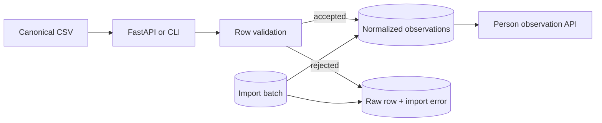

# Architecture

## Components and data flow

FastAPI and Typer are thin adapters over shared entity, catalog, query, and import services.
Repositories assemble database queries; SQLAlchemy maps domain records; Alembic owns schema history;
PostgreSQL provides durable constraints and JSONB for rejected raw rows.

Imports hash the original bytes, create an immutable batch identity, validate each row before
persistence, resolve the subject only by an explicit external reference, and attach person, source,
batch, filename, row, and source-record provenance. No person or unit is guessed.

## Data layers

- Raw: every accepted or rejected source row is retained as protected JSONB, while exact file bytes
  are identified by SHA-256 and filename. A managed encrypted object store is planned for file-byte
  retention.
- Normalized: typed observations and explicit units provide the canonical query surface.
- Derived: future calculations will use separate tables with algorithm/version/input lineage and
  will never overwrite normalized source observations.

## Identity, devices, and permissions

`Person` is the health-data subject and receives an immutable UUID. `UserAccount` is a login
identity. `AccessGrant` connects them explicitly; household membership never grants access. Devices
are independent assets with time-bounded person assignments, so a shared device can move among
people without rewriting history.

## Evolution

A future responsive web app can consume `/api/v1` without backend restructuring. Future Samsung
Health or Android connectors will produce import batches through the same validation boundary.
Document ingestion will preserve original documents in protected object storage and normalize
reviewed facts with page/field provenance. A later analytics layer will compute versioned personal
baselines and trends without making diagnoses.
