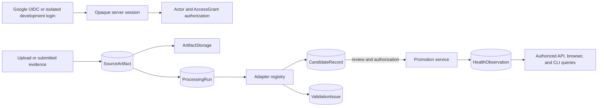

# Architecture

FastAPI, server-rendered HTML, and Typer are adapters over shared authentication, authorization,
catalog, ingestion, promotion, and query services. SQLAlchemy maps the domain, Alembic owns schema
history, PostgreSQL 16 supplies durable constraints, and artifact bytes are accessed only through
`ArtifactStorage`.

Authentication proves the external identity; it never grants person access. Every person-scoped
service receives an `Actor` and checks an active, unrevoked, unexpired `AccessGrant`. Household
membership has no permission semantics. System administrators manage accounts and grants but do not
read health data without a separate person grant.

Source artifacts are evidence metadata plus a storage reference. Adapters inspect bytes and emit
typed drafts but do not authorize or create canonical records. Processing persists candidates and
issues before the promotion service validates type, subject, unit, authorization, and provenance.
The canonical CSV adapter is trusted for automatic promotion only when every row is unambiguous and
the submitter has write access.

The application is synchronous in 0.2A. Background jobs, cloud object storage, malware scanning,
and multimodal AI providers can implement existing boundaries later without replacing the staged
pipeline.
