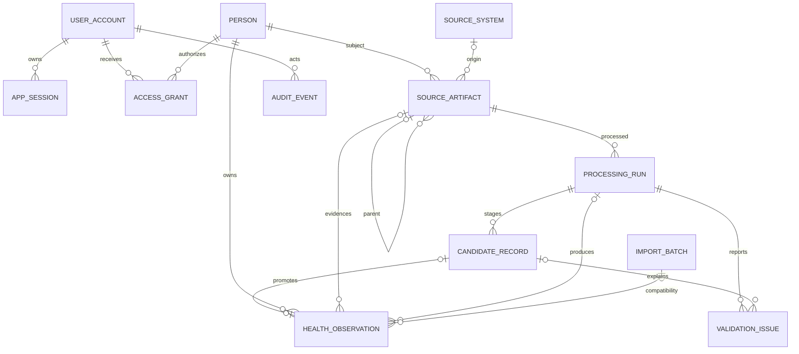
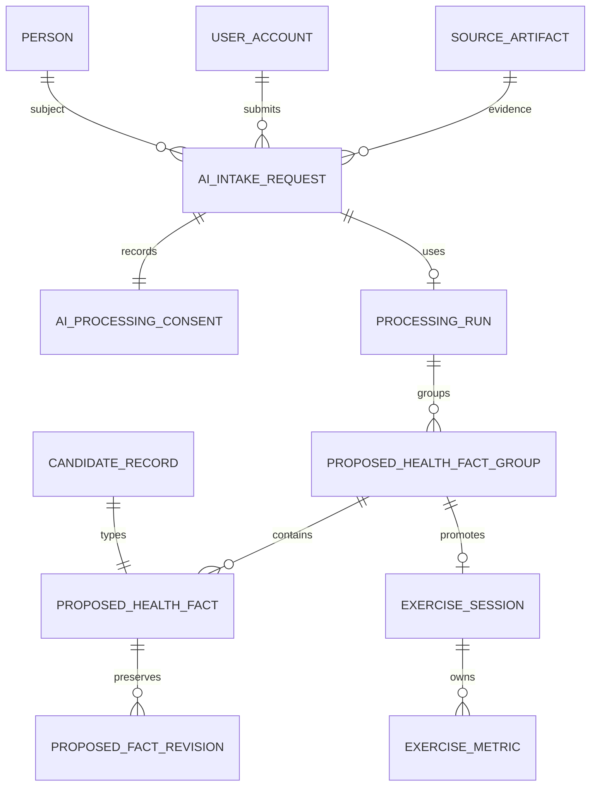

# Data model

All identifiers are UUIDs and timestamps are timezone-aware.

- **UserAccount:** durable `(auth_provider, provider_subject)` identity, mutable email/profile
  metadata, verification state, pending/active/disabled status, system-administrator flag, and login
  audit time. Email is not an external key.
- **AppSession:** hash of an opaque random session token, CSRF-token hash, expiry, and invalidation
  time. Raw tokens are never stored.
- **AccessGrant:** explicit user/person role, optional caregiver approval capability, grant time,
  optional expiry/revocation, and granting/revoking actors.
- **SourceArtifact:** immutable evidence description, subject/source context, submitter, parent,
  extensible kind and sensitivity strings, hash/length, storage reference, lifecycle status, and
  metadata. Raw bytes are not relational columns.
- **ProcessingRun:** adapter identity/version/schema, requester, lifecycle, coherent counts,
  configuration, and safe error summary.
- **CandidateRecord:** typed proposed record, subject, source locator, raw/normalized candidate JSON,
  lifecycle, confidence, approval, and rejection audit fields.
- **ValidationIssue:** structured severity/code/message, optional field/candidate, and source locator.
- **HealthObservation:** typed canonical value with existing Version 0.1 provenance plus artifact,
  run, candidate, adapter, submitter, and approver links. Candidate linkage is unique.
- **ImportBatch:** retained as the Version 0.1 compatibility summary, now linked to artifact and run.
- **AuditEvent:** immutable security-administration actor/action/target record without health payloads.

Observations remain append-only. A complete correction/supersession service is deferred rather than
adding unused mutable fields. Existing observations migrate unchanged and remain queryable.

## AI intake and exercise additions

The fact table permits at most one typed value and constrains confidence to 0 through 1. Original
proposals remain immutable while revision events preserve corrections, removals, and reviewer-added
facts. Unique candidate and exercise-group relationships support idempotent promotion. Laboratory
facts remain persistent staged records so panel grouping and reference ranges are not lost.
