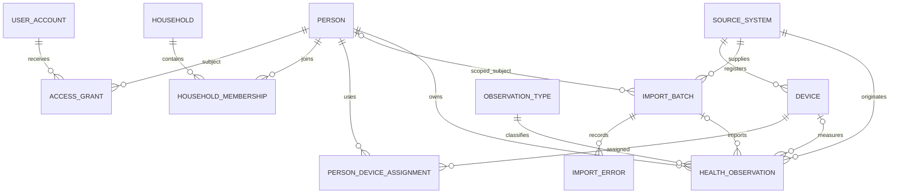

# Data model

All entity identifiers are UUIDs and all timestamps are timezone-aware.

- **Person:** first-class health-data subject; optional unique external reference, names, birth date,
  IANA timezone, lifecycle status, and audit timestamps.
- **UserAccount:** login identity with unique email; deliberately separate from Person.
- **AccessGrant:** explicit role-based user-to-person grant with grant/revocation times. Roles are
  owner, administrator, caregiver, and viewer. Version 0.1 records but does not enforce grants.
- **Household / HouseholdMembership:** named grouping and temporal person membership. Membership is
  many-to-many over time and has no permission semantics.
- **SourceSystem:** named origin/vendor/version metadata for imports and devices.
- **Device:** reusable physical source, optionally associated with a source system.
- **PersonDeviceAssignment:** temporal person/device link; the database rejects inverted ranges.
- **ImportBatch:** file hash, source, optional explicit subject/importing user, lifecycle status,
  statistics, importer version, and original filename. Its hash key makes file reruns idempotent.
- **ObservationType:** unique stable code, display metadata, value type, category, and expected unit.
- **HealthObservation:** exactly one person and one typed value, explicit unit and method/reliability,
  temporal bounds, raw source row, and links to source, optional device, batch, source record, and
  source row. Raw row data is deliberately omitted from API responses.
- **ImportError:** row number, stable error code, message, and raw rejected row JSON.

Database checks enforce typed-value exclusivity and valid time ranges. A unique provenance key
supports initial duplicate detection.
