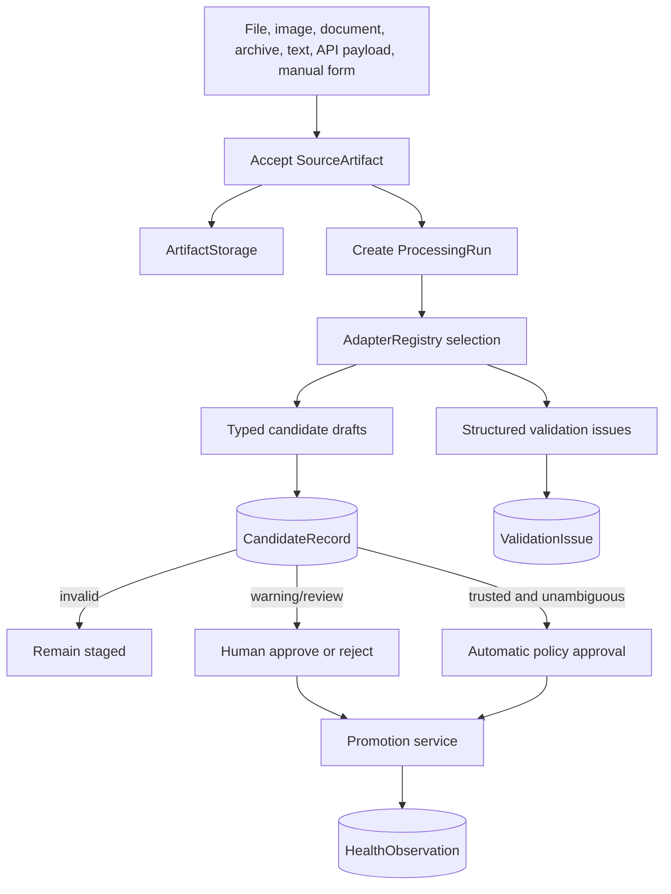
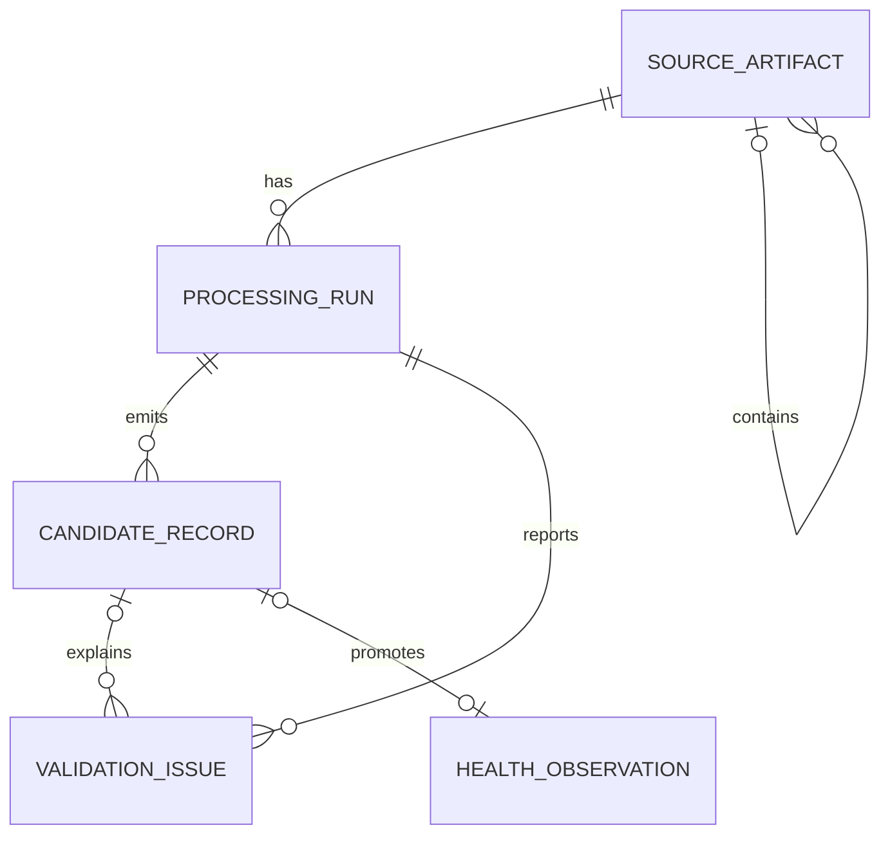

# Universal ingestion framework

## Data flow

## Artifacts and storage

`SourceArtifact` supports optional subjects, source systems, parent/child archives, extensible kinds,
captured/received times, sensitivity metadata, and file or external references. Byte content is
hashed and stored outside relational columns. Conversational text and API payloads can use their own
kinds without pretending to be files.

`ArtifactStorage` supplies `put`, `get`, `exists`, `delete`, and `open_stream`. The local backend uses
server-generated UUID/hash keys, rejects absolute/traversal keys, never incorporates the original
filename, and refuses overwrites. Deleting or superseding a canonical record never silently deletes
source evidence. Explicit artifact retention/deletion policy must precede any future deletion API.

## Adapters and lifecycle

Adapters declare name, implementation version, schema version, kinds, media types, and extensions.
The registry selects by these characteristics or an explicit name; it is not a central if/elif
dispatcher. An adapter receives typed context and returns typed candidates, issues, and a summary.
It performs neither authorization nor canonical commits.

Runs use pending/processing/review/completed/error/failed/cancelled states. Candidates use validation,
review, approval, rejection, promotion, and failure states. Approval/rejection records actor/time and
reason. Invalid records cannot promote; warning-driven records wait for review. Promotion checks
candidate type, person, unit, grant, and source provenance in a transaction and returns an existing
observation for repeated promotion.

## Future adapters

`WorkoutImageAdapter` can call a later multimodal-provider abstraction and stage exercise sets with
confidence and bounding/source references. `NarratedMealAdapter` can stage parsed foods before a
nutrition matcher. `MedicalPortalAdapter` can preserve document/page/field provenance and mandatory
human review. Samsung, Hume, generic spreadsheets, archives, and API responses use the same contract.
No production AI, OCR, nutrition, wearable, or medical-document interpretation exists in 0.2A.

## AI-assisted intake extension

Version 0.2B reuses the evidence, run, candidate, issue, authorization, and audit records for AI
intake. A provider produces a strict provider-neutral health-fact schema. Each proposal becomes a
typed candidate/fact before deterministic registry validation; no provider can bypass promotion.

AI operation identity combines artifact scope with provider, prompt version, and output schema.
Confirmation is independently idempotent at each canonical destination. Unsupported facts remain
staged, and human corrections never rewrite the retained original proposal. Future narrated meals,
nutrition labels, and medical documents use the same boundary.
